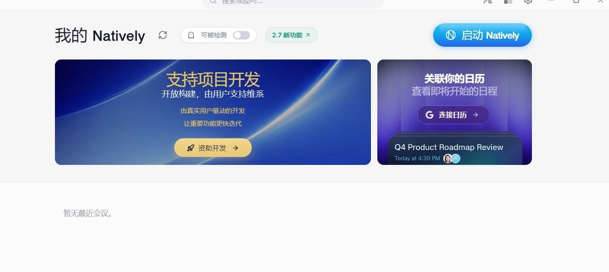
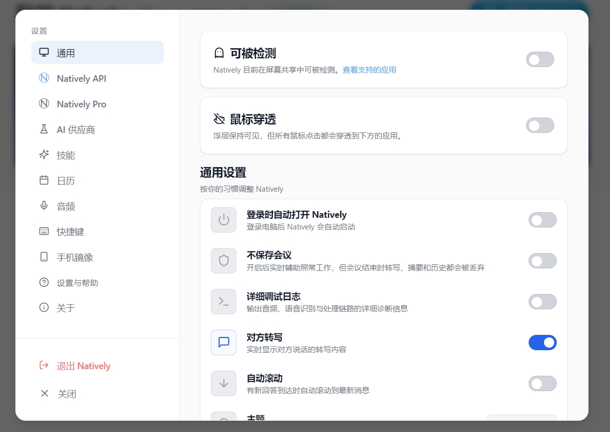
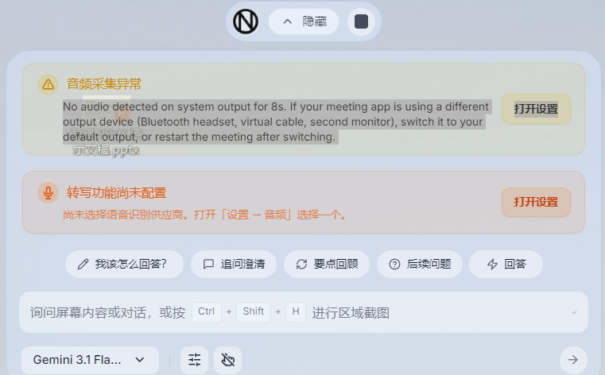
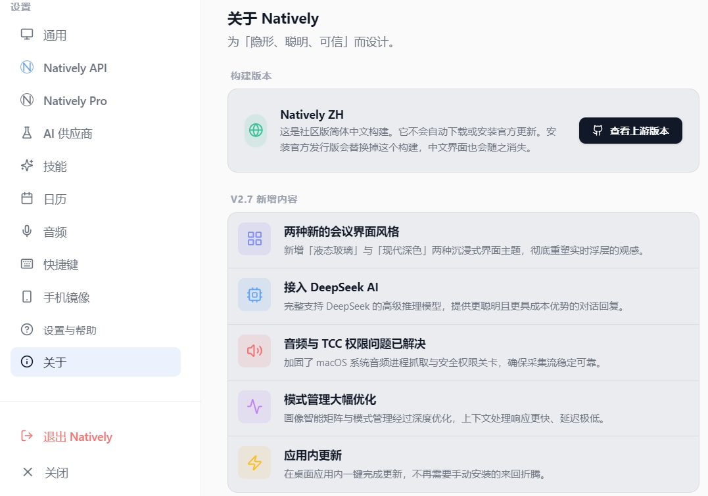

<div align="center">


# Natively ZH

**完整简体中文化的 AI 会议助手 / 面试副驾** — 界面、托盘、原生对话框全部中文，可一键切回英文。

[](LICENSE)
[](#安装)
[](https://github.com/Natively-AI-assistant/natively-cluely-ai-assistant)
[](docs/zh-cn/i18n-allowlist.md)
[](#与官方的关系)

[界面预览](#界面预览) · [安装](#安装) · [从源码运行](#从源码运行) · [汉化范围](#汉化范围) · [与上游的差异](#与上游的差异) · [已知限制](#已知限制) · [English](#english)

</div>

---

> [!IMPORTANT]
> **这是非官方 fork。** 与 Natively 官方无关联，不提供官方的 Natively API、
> Pro 订阅、支付、退款或客户支持。详见[与官方的关系](#与官方的关系)。

## 这个 fork 解决什么问题

上游 [Natively](https://github.com/Natively-AI-assistant/natively-cluely-ai-assistant)
是一个开源的实时会议 / 面试助手：本地采集系统音频与麦克风、实时转写、
把屏幕和对话上下文交给大模型生成建议。功能很强，但**界面只有英文**，
而且没有国际化基础设施 —— 上游 `ROADMAP.md` 把多语言列为「后续能力」。

本 fork 补上这一层，并且**不是硬编码替换**，而是建立了一套可维护的
i18n 资源层：

|  | 上游 v2.7.0 | 本 fork |
|---|---|---|
| 界面语言 | 仅英文 | **简体中文 / English 实时切换** |
| i18n 框架 | 无 | i18next + react-i18next，10 个业务域词典 |
| 主进程文案（托盘 / 通知 / 对话框） | 英文硬编码 | **独立的极简翻译器**，无需引入 React |
| 中文字体 | 字体栈**不含任何 CJK 字体** | Microsoft YaHei UI → PingFang SC → Noto Sans CJK SC |
| 日期 / 数字格式 | 部分写死 `en-US` | 跟随界面语言，`Intl` 格式化 |
| 语音识别默认值 | 英语 | 中文（`zh-CN` / `chinese`） |
| 发行标识 | 官方 | **完全隔离**，可与官方版并存 |
| 官方自动更新 | 启用 | **禁用**，只保留手动查看上游版本 |

## 界面预览

<table>
<tr>
<td width="50%"></td>
<td width="50%"></td>
</tr>
<tr>
<td><b>启动器</b><br/>产品名 <code>Natively</code> 与模型名保持原文，其余全部本地化。</td>
<td><b>设置总览</b><br/>侧栏 14 个页签、开关说明与状态文案；<code>Natively API</code> / <code>Natively Pro</code> 作为产品名不译。</td>
</tr>
<tr>
<td></td>
<td></td>
</tr>
<tr>
<td><b>会议浮层</b><br/>注意「音频采集异常」下方<b>保留了供应商的英文原始错误</b> —— 中文摘要负责让你看懂，原文负责让你能复制去排错（设计规格 §11）。<br/>输入框提示里的 <code>Ctrl</code>+<code>Shift</code>+<code>H</code> 徽标嵌在句中，是用 <code>&lt;Trans&gt;</code> 整句键渲染的，中英语序不同也不会错位。</td>
<td><b>关于 → 构建版本</b><br/>明确告知这是社区中文构建、不会自动下载或安装官方更新，以及安装官方发行版会移除中文界面。「查看上游版本」只打开 GitHub releases 页面。</td>
</tr>
</table>

### 三类语言设置互不干扰

这是本地化里最容易做错的一点。应用里有三个**独立**概念，切换任一个都不会
连带改动另外两个：

| 设置 | 控制什么 | 中文取值 |
|---|---|---|
| `uiLocale` | 界面语言 | `zh-CN` |
| `sttLanguage` | 语音识别语言 | `chinese`（内部键，映射到 `zh-CN` / `zh`） |
| `aiResponseLanguage` | AI 回复语言 | `Chinese` |

切换界面语言**不会**重启语音识别流、**不会**改变 AI 回复语言。设置页另有一个
「一键切换中文语音与回答」按钮，只在你主动点击时才同时设置后两项。

### 多窗口同步

应用同时运行 5 个 `BrowserWindow`（启动器、会议浮层、设置、模型选择、截图裁剪）。
语言由主进程的 `LocaleManager` 持久化，通过类型化 IPC 广播到全部窗口 ——
不会出现「设置窗口是中文、浮层还是英文」的割裂状态。托盘不是
`BrowserWindow`、收不到广播，所以在语言切换后会显式重建。

每个 React 根节点都是**先取到 locale 再渲染首帧**，所以启动时不会闪一下英文。

## 安装

从 [Releases](../../releases) 下载 `Natively-ZH-Setup-*.exe`，运行后
**手动选择安装目录**（安装器允许改路径）。

| | 路径 |
|---|---|
| 安装目录 | 你自己选，例如 `D:\Natively-ZH` |
| 用户数据 | `%APPDATA%\natively-zh` |
| appId | `com.natively.zh.desktop` |
| 开始菜单 | `Natively ZH` |

**与官方版完全隔离**，两者可以并存，各自的会议数据库互不干扰。

<details>
<summary>装不上？两个常见原因</summary>

**1. C 盘空间不足。** 安装包解压后约 2 GB。若 `%TEMP%` 所在盘剩余空间紧张，
NSIS 会在释放插件 DLL 时失败，报「抽取: 无法写入文件 … WinShell.dll」。
清理 `%TEMP%` 或临时把它指向别的盘：

```powershell
$env:TEMP='D:\tmp'; $env:TMP='D:\tmp'
& .\Natively-ZH-Setup-2.7.0-zh.1.exe
```

**2. 国产安全软件拦截。** 本构建**刻意未做代码签名**（不伪装成官方签名发行版），
部分安全软件会拦截未签名程序往 `%TEMP%` 释放 DLL。把安装包加入信任区即可。

</details>

## 从源码运行

### 工具链

| 项 | 版本 | 说明 |
|---|---|---|
| Node.js | **20 LTS** | `better-sqlite3` 不支持 Node 26 |
| Rust | stable MSVC | 编译原生音频模块 |
| VS Build Tools | Desktop C++ + Windows SDK | `node-gyp` 依赖 |

### 构建

```bash
npm ci
npm run build            # ⚠️ 会先 rimraf dist 与 dist-electron
npm run build:electron   # ⚠️ 必须在 build 之后，顺序不能反
npm run build:native     # Rust 原生模块
```

> [!WARNING]
> `npm run build` 的第一步是 `rimraf dist dist-electron`，会删掉
> `build:electron` 的产物。**顺序反了主进程就是空的。**

### 启动

```bash
npm start                # 开发模式（Vite + Electron）
npm run electron:build   # 生产模式
```

<details>
<summary>Windows 上的三个坑</summary>

```powershell
# 1. ELECTRON_RUN_AS_NODE 会让 electron.exe 退化成普通 Node，
#    require('electron') 拿不到 app，主进程在模块初始化期崩溃
$env:ELECTRON_RUN_AS_NODE = $null

# 2. 必须用 Node 20（若全局是别的版本）
$env:PATH = "D:\Node20;$env:PATH"

# 3. npm start 硬编码端口 5180。被占用时 Electron 会加载**别的应用的页面**，
#    不报错、只是内容不对。改 package.json 里的 --port，或用生产模式。
```

内存紧张时（esbuild 是 Go 程序，峰值较高）限制并行度：
`$env:GOMAXPROCS='1'`。

</details>

### 质量门禁

```bash
npm run check:i18n   # 三道：词典完整性 → 残留英文扫描 → 键引用检查
npm run test:i18n    # 44 项
npm test             # 全量回归
```

> [!NOTE]
> `npm test` 的判定标准**不是全绿**。上游基线自带 88 条失败（私有 `premium`
> 子模块缺失、测试自身的 Windows 路径问题、OpenAI Realtime 协议源码与测试
> 不一致）。判定标准是**失败集合与 `docs/zh-cn/baseline-test-failures.tsv`
> 逐条一致**。详见 [`docs/zh-cn/CONTINUE-HERE.md`](docs/zh-cn/CONTINUE-HERE.md)。

## 汉化范围

**词典 1380 个键，中英各 10 个业务域：**

| namespace | 键数 | 覆盖 |
|---|---|---|
| `settings` | 513 | 设置全部页签、供应商配置、快捷键、音频、日历 |
| `help` | 379 | 帮助与配置指南（11 章）、演示样机 |
| `providers` | 123 | AI 供应商、模型、数据范围 |
| `meeting` | 92 | 会议主界面、音频状态、建议浮层 |
| `updates` | 68 | 更新、试用、配额 |
| `errors` | 52 | 用户可见错误摘要 |
| `common` | 47 | 通用动作与状态 |
| `launcher` | 49 | 启动器 |
| `onboarding` | 38 | 首次启动、权限引导 |
| `history` | 19 | 历史、会议详情、裁剪器 |

### 三道自动门禁

1. **词典完整性** — 中英键集合必须完全一致、插值变量一致、值非空、
   键名必须是语义键而非英文句子
2. **残留英文扫描** — 用 TypeScript AST（不是正则）扫 `src/` 下全部
   **57 个 `.tsx`**，覆盖 JSX 文本、表达式子节点、文本属性、组件 prop、
   对象字面量、`alert`/`confirm`、`set*Error` 实参、`return`、数组元素、
   带插值的模板字符串
3. **键引用检查** — 反查源码里每个 `t()` / `<Trans>` 引用的键是否真的存在。
   前两道都不管这个，而缺键会**静默回退成键名本身显示给用户**

### 不翻译什么

**153 条允许名单**，全部永久，逐条写明理由，清单见
[`docs/zh-cn/i18n-allowlist.md`](docs/zh-cn/i18n-allowlist.md)（由脚本从名单生成，
不手写，避免文档漂移）：

产品名与供应商名 · 模型 ID · API 字段名 · 可复制执行的命令 · 密钥前缀 ·
键盘按键名 · BCP 47 语言代码 · 云区域 ID · 真实联系方式 · 技术栈名称

**过期条目会导致门禁失败** —— 这是有意设计，防止名单膨胀成永远绿灯的挡箭牌。

运行时产生的内容不进名单也不翻译：第三方供应商返回的原始错误详情
（界面显示「中文摘要 + 可展开的英文原文」，便于你复制给供应商排错）、
你上传的文档、会议原始转写、AI 回答正文（由 `aiResponseLanguage` 决定）。

## 与上游的差异

除界面语言外，只改了发行隔离与更新安全，**核心逻辑一律未动**：

**改了：**
- 独立 appId / 产品名 / 用户数据目录 / 开始菜单项
- 禁用官方后台自动下载与退出时自动安装；移除 `build.publish`
- 中文字体栈与 `Intl` 日期数字格式化
- `package.json` 的 `license` 从 `ISC` 改为 `AGPL-3.0`
  （上游元数据与 LICENSE 文件矛盾）
- 移除失效的 `react-query` 依赖别名（缺 `npm:` 前缀，是死代码且阻塞打包）

**没改：** 音频采集、语音识别、LLM 调用、RAG、数据库结构与算法。
也**没有**增加、强化或调试任何隐藏窗口、进程伪装、规避录屏检测或反监考能力 ——
对相关既有代码只翻译了用户可见文字。

## 已知限制

1. **可执行文件的嵌入元数据仍是 Electron 默认值。** `rcedit` 打包在
   electron-builder 的 `winCodeSign` 里，而该包含 macOS 符号链接；
   Windows 上创建符号链接需管理员权限或开启开发者模式。当前构建用
   `--config.win.signAndEditExecutable=false` 绕过该工具链。
   影响仅限 exe 图标与版本资源，安装包身份与数据隔离都正常。
   **用管理员权限重跑一次打包即可修复。**
2. **`premium` 是上游私有子模块。** 本 fork 无权限、从未初始化，
   `git submodule update` 会失败 —— 这是预期行为，开源降级路径不依赖它。
3. **未做代码签名。** 刻意如此，见[与官方的关系](#与官方的关系)。
4. **仅验证 Windows x64。** macOS 相关代码保留但未构建验证。

## 同步上游

上游基线是 tag `v2.7.0`（commit `be7280b`），本 fork 在其之上 27 个提交。

```bash
git remote add upstream https://github.com/Natively-AI-assistant/natively-cluely-ai-assistant.git
git fetch upstream
git merge upstream/main        # 或某个新 tag
npm run check:i18n             # 新增的英文文案会在这里红灯
```

合并后请读一遍
[`docs/zh-cn/CONTINUE-HERE.md`](docs/zh-cn/CONTINUE-HERE.md)
的「迁移陷阱」一节 —— 里面记了 7 类实际踩过的坑，例如字面量兼作样式判别器、
模块作用域数据表用不了 hook、局部变量遮蔽翻译函数等。

## 与官方的关系

- **非官方，无关联。** 本 fork 不由 Natively 官方维护。
- **不提供任何官方服务** —— 没有官方 Natively API、Pro 订阅、支付、退款或客户支持。
  仓库里保留的 `termsandcondition.md`、`refund.md`、`PRIVACY.md` 约束的是
  **上游官方服务**，与本 fork 无关，请勿据此向本仓库主张权利。
- **不伪装成官方发行版。** 刻意不做代码签名，产品名与 appId 全部独立。
- **不会静默覆盖官方版。** 已禁用后台自动更新；「关于」页保留手动查看上游
  版本的入口，但会明确提示安装官方发行版将替换本构建并移除中文界面。
- 想装回官方版？见 [`docs/zh-cn/rollback.md`](docs/zh-cn/rollback.md)。
  两者数据目录独立，回退不需要删除任何数据。

## 文档

| 文件 | 内容 |
|---|---|
| [`docs/zh-cn/CONTINUE-HERE.md`](docs/zh-cn/CONTINUE-HERE.md) | 开发环境、门禁设计、迁移陷阱（接手必读） |
| [`docs/zh-cn/i18n-allowlist.md`](docs/zh-cn/i18n-allowlist.md) | 允许保留英文的清单及理由 |
| [`docs/zh-cn/release-checklist.md`](docs/zh-cn/release-checklist.md) | 发布前检查清单 |
| [`docs/zh-cn/rollback.md`](docs/zh-cn/rollback.md) | 回退到官方版 |
| [`docs/zh-cn/evidence/`](docs/zh-cn/evidence/) | 各阶段验证证据（含运行时 DOM 读取记录） |
| [`README.upstream.md`](README.upstream.md) | 上游原版 README（完整保留） |

## 贡献

欢迎报告翻译问题。提 issue 时请附上：

- 出问题的界面与路径（例如「设置 → 音频 → 语音识别供应商」）
- 期望译法与理由（术语建议参考微软或 Apple 的官方中文术语）
- 界面语言设置（`简体中文` 还是 `English`）

改动文案请一并跑 `npm run check:i18n` 与 `npm run test:i18n`。
新增文案必须同时补中英两侧的键，否则第一道门禁会红灯。

## 许可证

**AGPL-3.0**，与上游一致。见 [LICENSE](LICENSE)。

原始项目 [Natively](https://github.com/Natively-AI-assistant/natively-cluely-ai-assistant)
由 Evin John 开发，版权归原作者所有。本 fork 仅做本地化，遵循 AGPL-3.0
的传染性要求以同一许可证发布，并保留全部原始版权声明。

---

## English

**Natively ZH** is an **unofficial** Simplified-Chinese localization fork of
[Natively](https://github.com/Natively-AI-assistant/natively-cluely-ai-assistant)
v2.7.0 (`be7280b`).

It adds a real i18n layer (i18next, 1380 keys across 10 namespaces) covering the
renderer, the Electron main process (tray, dialogs, notifications), a CJK font
stack, and locale-aware date/number formatting. UI language switches live between
`zh-CN` and `en-US` across all five windows.

`uiLocale`, `sttLanguage`, and `aiResponseLanguage` are kept as **three
independent settings** — switching the UI language never restarts the STT stream
or changes the AI answer language.

Core audio capture, STT, LLM, RAG, and database logic are **untouched**. No
stealth, process-masquerading, or screen-share-evasion capability was added,
strengthened, or debugged — only user-visible strings in existing code were
translated.

**Not affiliated with or supported by the Natively project.** It provides none of
the official Natively API, Pro subscriptions, payments, refunds, or support. The
commercial terms files kept in this repo apply to the **upstream** service, not
to this fork. This build is intentionally **unsigned** and uses an isolated
appId, product name, and user-data directory, so it coexists with an official
install and never silently replaces it.

Licensed under **AGPL-3.0**, same as upstream. Original work © Evin John.
